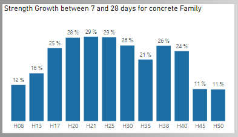

# Concrete Quality Control

For this project, I used a dataset from an old Excel file that I previously used to control the quality of dispatched concrete at my previous job. This Excel file stored all the compression strength results for every sample we tested in our laboratory. As the file was getting too large, I decided to switch from Excel to Power BI to improve the analysis and performance of our reports.

## The Data Model

As mentioned before, each row in the main table represents a concrete cylinder that was molded and later tested. The dataset includes details such as the molding date, testing date, truck, driver, client, technician who took the sample, concrete mix, and the plant where the concrete came from. With this information, I built the following data model, shown in the next figure.

## The analysis

To enhance the initial quality control analysis, I added two new pages to the report.

### Concrete Strength Analysis

On this page, I calculated the average strength for samples at 28 days old and 7 days old. I also included a 3-month moving average to identify patterns and understand how the concrete strength is developing over time.

I analyzed the standard deviation to see how different factors, like plants and drivers, influenced this deviation, showing which areas might need improvement (for example, plants that are not performing well or drivers who need better training). Another interesting insight is that the strength growth between 7 and 28 days is limited in lower-strength families by the cement content and in higher-strength families by the coarse aggregate and cement interface, as shown in the following distribution.

### Concrete Strength Seasonality

On this page, I analyzed the seasonality of concrete strength, showing how it gains more strength later in colder months and loses strength in warmer months. The analysis shows that when temperatures are lower and the strength grows more slowly, the concrete reaches higher values at 28 days on average. In contrast, when temperatures are higher and the strength increases more rapidly, the concrete reaches lower values at 28 days on average.

Te seasonality analysis was inspired by the work of [Carlos Barboza](https://www.linkedin.com/in/merod/) and his [Youtube video](https://www.youtube.com/watch?v=WK5KE8HoEsA&list=WL&index=5&t=2758s).

