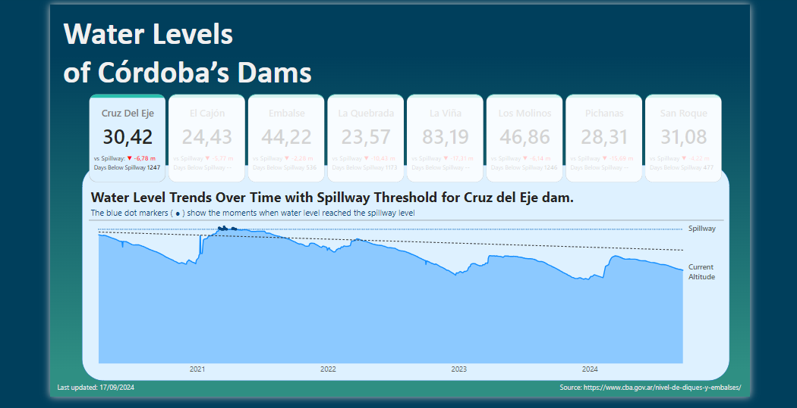

# Water Levels of Córdoba’s Dams - Power BI Dashboard

## Overview

This Power BI dashboard provides a visual analysis of water level trends for various dams in Córdoba, Argentina, over the past four years. It allows users to track the daily water level variations and compare them against the spillway threshold, highlighting instances when water levels reached or exceeded this critical point. The dashboard is designed to give insights into seasonal changes, historical trends, and potential risks associated with fluctuating water levels.

## Features

* **Water Level Trends**: Visualize the daily changes in water levels for multiple dams, with a clear distinction between current altitude and the spillway threshold.
* **Spillway Threshold Analysis**: Blue dot markers indicate specific points in time when water levels were at or above the spillway threshold, helping to identify periods of high water levels.
* **Comparative View**: Easily switch between different dams to compare water level trends and assess risk factors for each one.
* **Interactive Filters**: Each card representing a dam acts as a filter button. By clicking on a card, you can instantly switch the focus of the analysis to the selected dam, allowing for a seamless and intuitive user experience.

## Data

The data used in this dashboard includes:

* Daily Water Levels: Recorded measurements for each dam over the past four years.
* Spillway Threshold Levels: The spillway level for each dam, providing a benchmark for critical water levels.
* Dams Included: Eight dams across Córdoba province, Argentina.

## Dashboard

Here is an image of the dashboard.

