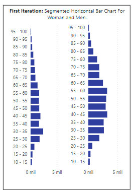
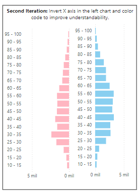
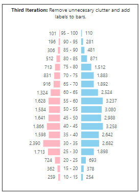
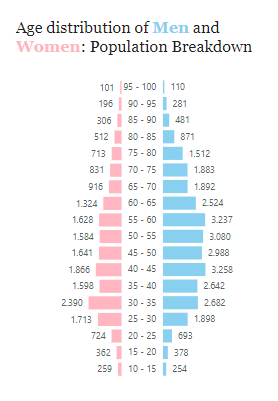

# KYC Project

In this project, I will share how I created some of the visualizations in Power BI for a KYC project for a previous client. Due to confidentiality reasons, the Power BI file itself won't be shared, but I'll include screenshots of similar visualizations made with synthetic data and explain the main ideas behind them.

The primary objective of this project was to visualize all the information gathered from clients through the bank's system, which was stored in SQL Server. The client's preferred tool was Power BI, as it was the one they were already using.

## Age Range Distribution for women and men

### First Iteration

In this initial chart, we present the population count for women on the left and men on the right, separated into two mirrored bar charts. Each bar represents an age range available in the dataset, showing the distribution of the population across these ranges. The filter

### Second Iteration

In our second iteration, we introduced color coding to the bars in order to add more visual clarity to the chart. This eliminates the need for an extra legend, as the colors (pink for women and blue for men) help distinguish the data at a glance. The color scheme is also reflected in the title to reinforce the meaning without crowding the chart.

Additionally, we inverted the X-axis of the left chart, which gives the appearance that both charts originate from the same central axis, enhancing the symmetry and overall readability of the visualization.

### Third Iteration

In our final iteration, we focused on reducing unnecessary visual elements to minimize the cognitive load for our users. By aligning both charts symmetrically, we made effective use of the central axis. Additionally, we removed the X-axis and added data labels directly onto the bars to provide clearer and more immediate insights.

### Final Version

Here is a simplified final version of what was presented to the client.

