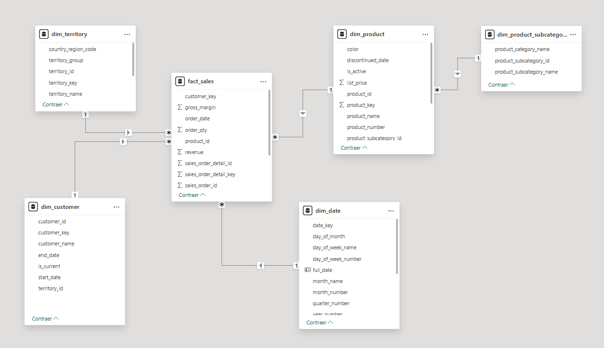

# Sales Dashboard

This project showcases an end-to-end Business Intelligence solution to analyze sales data. It includes the construction of an ETL process using SQL Stored Procedures to build a simplified Data Warehouse. From there, we define key metrics to evaluate and monitor sales performance. Finally, we design an interactive dashboard to visualize these insights and provide business context.

## Contents

- SQL Scripts for staging and transformation
- Data Warehouse schema
- Power BI Dashboard (.pbix)
- Dashboard background design
- Screenshots and demo

## Technologies

- SQL Server 2019
- T-SQL Stored Procedures
- Power BI
- AdventureWorks 2019 (sample dataset)

## Business Questions Answered

- What are the total sales and how have they evolved over time?
- Which products and categories drive the most revenue?
- Which regions perform better and why?
- How does customer behavior impact sales?

## About

This dashboard was developed as part of the BI portfolio for Denovo Studios, and is also used in the author's personal portfolio to showcase technical and analytical skills.

# Data Modeling

Data modeling is the process of designing tables and relationships between them in order to answer all relevant business questions from stakeholders—while being optimized for performance and cost-efficiency.
In other words, our main goal is to provide accurate answers using the minimum amount of computational resources and storage.

This model, composed of fact and dimension tables, is designed to mirror the real-world process we are analyzing—in this case, **sales**.
The key difference compared to the architecture of a transactional system lies in the purpose of each: transactional databases are optimized for atomic operations (create, update, delete), whereas analytical models are optimized for reading and aggregating large volumes of data.

While transactional systems can be used to answer analytical questions, doing so is often resource-intensive due to their normalized structure, which requires multiple joins and complex queries.

That’s why we’ve built this star-schema model: to isolate only the relevant information and store it in a way that allows us to answer questions—such as “What was the best-selling product last month?”—as efficiently as possible.

The following diagram represents the model used in this project:



## Star Schema Tables and Columns

Below is an overview of the fact and dimension tables included in the data model, along with the key columns and their data types:

```yaml
tables:
  - name: fact_sales
    description: Fact table containing sales order details.
    columns:
      - name: sales_order_id
        type: INT
        description: Unique ID of the sales order.
      - name: sales_order_detail_id
        type: INT
        description: ID of the item line within the order.
      - name: order_date
        type: DATE
        description: Date the order was placed.
      - name: customer_key
        type: INT
        description: Surrogate key referencing dim_customer.
      - name: territory_id
        type: INT
        description: Identifier for the sales territory.
      - name: product_id
        type: INT
        description: Product identifier from dim_product.
      - name: order_qty
        type: INT
        description: Quantity sold.
      - name: unit_price
        type: DECIMAL
        description: Sale price per unit.
      - name: unit_price_discount
        type: DECIMAL
        description: Discount applied per unit.
      - name: standard_cost
        type: DECIMAL
        description: Standard cost of the product.
      - name: revenue
        type: DECIMAL
        description: Total revenue after discount.
      - name: gross_margin
        type: DECIMAL
        description: Revenue minus standard cost.

  - name: dim_customer
    description: Dimension table storing customer information as a slowly changing dimension (Type 2).
    columns:
      - name: customer_key
        type: INT
        description: Surrogate key (primary key).
      - name: customer_id
        type: INT
        description: Business key from the source system.
      - name: customer_name
        type: VARCHAR
        description: Full name of the customer.
      - name: territory_id
        type: INT
        description: Foreign key to sales territory.
      - name: start_date
        type: DATE
        description: Start of the record validity.
      - name: end_date
        type: DATE (nullable)
        description: End of the record validity.
      - name: is_current
        type: BIT
        description: Flag indicating current active version.

  - name: dim_product
    description: Product dimension with attributes used for filtering and slicing.
    columns:
      - name: product_key
        type: INT
        description: Surrogate key (primary key).
      - name: product_id
        type: INT
        description: Business key from the source system.
      - name: product_name
        type: VARCHAR
        description: Name of the product.
      - name: product_number
        type: VARCHAR
        description: Unique product code or SKU.
      - name: list_price
        type: DECIMAL
        description: Listed price.
      - name: standard_cost
        type: DECIMAL
        description: Standard cost of the item.
      - name: color
        type: VARCHAR
        description: Color of the product.
      - name: discontinued_date
        type: DATE (nullable)
        description: Date the product was discontinued.
      - name: is_active
        type: BIT
        description: Indicates if the product is currently sold.

  - name: dim_territory
    description: Dimension for sales territories and regional groupings.
    columns:
      - name: territory_key
        type: INT
        description: Surrogate key (primary key).
      - name: territory_id
        type: INT
        description: Business key for the territory.
      - name: territory_name
        type: VARCHAR
        description: Name of the territory.
      - name: territory_group
        type: VARCHAR
        description: Territory group or classification.
      - name: country_region_code
        type: VARCHAR
        description: Country code associated with the territory.

  - name: dim_date
    description: Calendar dimension for time-based filtering and aggregations.
    columns:
      - name: date_key
        type: INT
        description: Surrogate key (primary key).
      - name: full_date
        type: DATE
        description: Full calendar date.
      - name: day_of_month
        type: INT
        description: Day of the month (1–31).
      - name: day_of_week_name
        type: VARCHAR
        description: Name of the weekday.
      - name: day_of_week_number
        type: INT
        description: Number of the weekday (1=Monday).
      - name: month_number
        type: INT
        description: Numeric month (1–12).
      - name: month_name
        type: VARCHAR
        description: Month name (e.g. January).
      - name: quarter_number
        type: INT
        description: Quarter (1–4).
      - name: year_number
        type: INT
        description: Year (e.g. 2023).

 ```

This marks the end of the modeling phase, where we defined a set of tables and relationships that allow us to answer key business questions related to the process under analysis.

Now that the data model has been established, the next step is to implement a set of transformations. In this project, they are developed in SQL and aim to:

1. Collect data from its original source,
2. Transform it into the desired analytical structure,
3. Store it in a new database (the data warehouse).

This data warehouse becomes the foundation from which we can build reports and dashboards to track business performance in a consistent and optimized way.

# Data Transformation and ETL Process

To move the data from its original source to its final destination, we first need to create all the required tables. This was done by executing the scripts provided in the [queries_for_tables.sql](https://github.com/mbbau/Power-BI-Portfolio/blob/main/Sales%20Dashboard/SQL%20Queries/queries_for_tables.sql) file within the database. 

To replicate a day-to-day ETL process, all data transformations were implemented using SQL stored procedures. Each procedure is designed to handle a specific step in the pipeline—from raw data extraction to final loading into the star schema model.

You can explore all the transformation scripts in the following folder of this repository: [SQL Queries – Transformations](https://github.com/mbbau/Power-BI-Portfolio/tree/main/Sales%20Dashboard/SQL%20Queries/Stored%20Procedures).

To ensure modularity and data quality, the process is executed in clearly defined stages:

1. **Staging Layer**
Raw data from the source system is loaded into staging tables. These tables replicate the structure of the original data but allow for controlled transformation without affecting the source.

2. **Dimension Tables**
After staging, dimension tables are built. For example, dim_customer is implemented as a Type 2 Slowly Changing Dimension (SCD), allowing us to preserve historical changes over time.

3. **Fact Table**
The fact table (fact_sales) is populated last, using cleaned and enriched data from both staging and dimensions. Surrogate keys are used to ensure referential integrity and to reflect the correct version of each dimension record at the time of the transaction.

This step-by-step process improves traceability, simplifies debugging, and mimics a real-world production ETL pipeline.

## Implementing a Slowly Changing Dimension (Type 2)

In this project, the dim_customer table was implemented as a Slowly Changing Dimension Type 2 (SCD2) to preserve historical changes in customer attributes over time.

### Why SCD Type 2?

Transactional systems only store the current version of each entity. However, in analytical scenarios, it’s often essential to understand how a customer's attributes—such as name, territory, or segment—have changed over time.
For example, if a customer moves to a different territory, we still want to attribute past sales to the territory they belonged to at the time of each transaction.

SCD Type 2 allows us to:

* Retain historical versions of each customer record.
* Track changes with effective date ranges (start_date, end_date) and a current flag (is_current).
* Join facts with the correct dimension version based on transaction date.

### How it was implemented

Below is the stored procedure used to load dim_customer with SCD2 logic:

``` sql

USE AdventureWorksDW;
GO

CREATE OR ALTER PROCEDURE dbo.sp_load_dim_customer
AS
BEGIN
    SET NOCOUNT ON;

    DECLARE @today DATE = CAST(GETDATE() AS DATE);

    -- Insert new customers not currently in the dimension
    INSERT INTO dbo.dim_customer (
        customer_id,
        customer_name,
        territory_id,
        start_date,
        end_date,
        is_current
    )
    SELECT
        sc.customer_id,
        sc.customer_name,
        sc.territory_id,
        @today,
        NULL,
        1
    FROM dbo.stg_customer sc
    LEFT JOIN dbo.dim_customer dc
        ON sc.customer_id = dc.customer_id AND dc.is_current = 1
    WHERE dc.customer_id IS NULL;

    -- Detect changes and close the current version
    UPDATE dc
    SET
        end_date = @today,
        is_current = 0
    FROM dbo.dim_customer dc
    INNER JOIN dbo.stg_customer sc
        ON sc.customer_id = dc.customer_id
    WHERE dc.is_current = 1
      AND (
          sc.customer_name <> dc.customer_name OR
          ISNULL(sc.territory_id, -1) <> ISNULL(dc.territory_id, -1)
      );

    -- Insert new version for changed customers
    INSERT INTO dbo.dim_customer (
        customer_id,
        customer_name,
        territory_id,
        start_date,
        end_date,
        is_current
    )
    SELECT
        sc.customer_id,
        sc.customer_name,
        sc.territory_id,
        @today,
        NULL,
        1
    FROM dbo.stg_customer sc
    INNER JOIN dbo.dim_customer dc
        ON sc.customer_id = dc.customer_id
    WHERE dc.is_current = 0
      AND NOT EXISTS (
          SELECT 1
          FROM dbo.dim_customer dc2
          WHERE dc2.customer_id = sc.customer_id
            AND dc2.is_current = 1
      );
END;
GO
```

This logic ensures that historical context is preserved and fact records can always be joined with the correct customer version.

The following diagram illustrates how a Type 2 Slowly Changing Dimension (SCD2) works in practice.
When an attribute of a customer changes (e.g., their state), a new row is added to the dimension table with updated values, a new surrogate key, and an updated effective date range.
This allows historical transactions to remain linked to the correct version of the customer as it existed at the time of each order—preserving accurate analytical context over time.


> 📚 *Figure adapted from* Christopher Adamson — *Star Schema: The Complete Reference* (McGraw-Hill, 2010).  
> Used here for educational and illustrative purposes only.